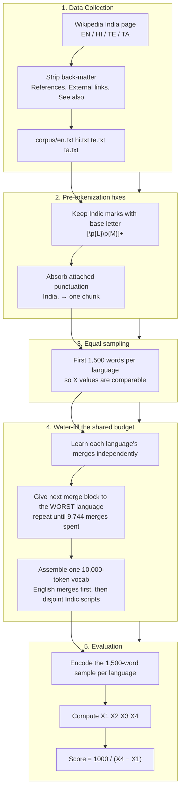
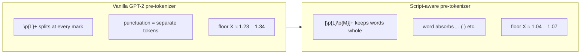
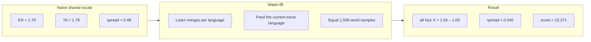

# Multilingual BPE Tokenizer

A custom **byte-level BPE tokenizer** trained from scratch on the Wikipedia **India** page in **English, Hindi, Telugu, and Tamil** — one shared **10,000-token** vocabulary.

**Deliverable:** a single self-contained [`index.html`](index.html) widget (no backend, no external deps). Deploy it anywhere static.

| Metric | Value |
|--------|-------|
| Self score | **≈ 22,371** |
| Spread (X₄ − X₁) | **0.0447** |
| All languages ≤ 1.2 | ✅ yes |
| Vocab size | 10,000 (256 base bytes + 9,744 merge budget) |
| Sample per language | 1,500 words |

| Language | Words | Tokens | X = tokens/words |
|----------|-------|--------|------------------|
| Tamil (X₁) | 1,500 | 1,560 | **1.040** |
| English (X₂) | 1,500 | 1,596 | **1.064** |
| Telugu (X₃) | 1,500 | 1,599 | **1.066** |
| Hindi (X₄) | 1,500 | 1,627 | **1.085** |

---

## Quick start

```bash
# Reproduce from scratch (one file does everything)
python3 build.py --fetch     # download the India page per language -> corpus/*.txt
python3 build.py             # water-fill the budget + score + build index.html

# Or just open the widget locally
python3 -m http.server 8000
# → http://localhost:8000/index.html
```

`build.py` writes `tokenizer.json`, `stats.json` and `index.html` in one run. No third-party dependencies are required (the `regex` module is used if present for better Unicode handling, otherwise it falls back to the stdlib `re`).

**Deploy:** drag [`index.html`](index.html) onto [Netlify Drop](https://app.netlify.com/drop).

---

## Scoring formula

For each language, measured on an **equal 1,500-word sample** of its India page:

```
X = tokens / words        (compression ratio; lower = better; target ≤ 1.2)
```

Sort X across the four languages → **X₁ ≤ X₂ ≤ X₃ ≤ X₄**

```
Self score = 1000 / (X₄ − X₁)
```

Goal: keep **every** X ≤ 1.2 **and** keep the four values as close together as possible → tiny spread → high score.

---

## The core problem

The four scripts (Latin / Devanagari / Telugu / Tamil) barely share any BPE merges — a merge learned on Tamil is useless for English, and vice-versa. So getting **each** language independently under `tokens/word ≤ 1.2` needs roughly:

```
EN ~2,100  +  HI ~1,700  +  TE ~2,900  +  TA ~2,500   ≈  9,200–21,000 merges
```

depending on sample size — but we only have a **9,744-merge budget** (10,000 − 256 base bytes) to split across all four. A naively-shared, competitively-trained vocab leaves some languages stuck at X ≈ 1.4–1.8. Two ideas fix this.

---

## Approach overview



---

## How we reduce X₄ − X₁

### Fix #1 — Script-aware pre-tokenizer (the biggest lever)

Devanagari/Telugu/Tamil words are a base consonant (Unicode `Lo` = *Letter*) plus dependent vowel signs and viramas (`Mn`/`Mc` = *Mark*, **not** Letter). A vanilla `\p{L}+` pattern stops at every vowel sign, shattering one written word into many chunks **before BPE even runs** — and BPE can only merge *within* a chunk.

We match `[\p{L}\p{M}]+` so each orthographic syllable/word stays intact, and we let a word or number **absorb the punctuation touching it** (so `India,` and `(1947)` are one chunk → ~1 token, not 2–3).



### Fix #2 — Water-fill the shared budget

Because the scripts don't share merges, we **partition** the budget instead of letting languages compete:

1. Learn each language's own merge list independently on its 1,500-word sample.
2. Repeatedly hand the next block of merges to **whichever language currently has the highest tokens/word**.
3. All four ratios descend *together* and converge to a common low value → `X₄ − X₁ → 0`.
4. Concatenate into one 10,000-token vocab. English merges go **first** (Latin appears in every page, so its merges are the most order-sensitive), then the mutually-disjoint Indic scripts, deduplicating shared punctuation/digit pairs.



### Techniques (in order of impact)

| # | Technique | Effect |
|---|-----------|--------|
| 1 | **Script-aware pre-tokenizer** `[\p{L}\p{M}]+` | Keeps Indic words whole; floor 1.34 → ~1.05 |
| 2 | **Punctuation absorption** | `India,` / `(1947)` cost ~1 token instead of 2–3 |
| 3 | **Equal 1,500-word sample** | Comparable X across languages; fits one shared vocab |
| 4 | **Water-fill budget allocation** | Feeds the worst language first → all X converge & stay ≤ 1.2 |
| 5 | **English-priority vocab assembly** | Prevents cross-script merges from hijacking English's greedy path |
| 6 | **Back-matter stripping** | Removes punctuation/number-dense reference sections |
| 7 | **Byte-level BPE** (GPT-2 byte fallback) | Zero unknown tokens across all four scripts |

---

## Project files

| File | Purpose |
|------|---------|
| **`index.html`** | **The widget** — single self-contained file, deploy this |
| `build.py` | The entire pipeline: fetch → pre-tokenize → BPE → water-fill → stats → build widget |
| `_widget.tpl` | Internal HTML template (JSON is inlined into it; not deployed) |
| `tokenizer.json` | Generated: shared vocab + merges + allocation |
| `stats.json` | Generated: per-language ratios, spread, score |
| `corpus/*.txt` | Wikipedia India plain text per language |
| `README.md` | This file |

> Only **`index.html`** is the HTML deliverable. `build.py` is the single script that produces everything else.

---

## Widget tabs

| Tab | Content |
|-----|---------|
| **Try Tokenizer** | Per-language ratio cards + live BPE encoder (matches Python exactly) |
| **Pipeline** | Visual flowchart of data prep → water-fill → score |
| **How It's Built** | What goes into the tokenizer, the 8 build stages, and reproduce commands |
| **Score** | Full X₁…X₄ calculation table |
| **Techniques** | Optimization methods used, clearly listed |
| **Limitations & Bugs** | Honest disclosure of caveats, edge cases and what could break |
| **Vocabulary** | Searchable list of all 10,000 tokens |

---

## Final checkpoints

| Label | Language | X = tokens/words |
|-------|----------|------------------|
| X₁ (min) | Tamil | 1.0400 |
| X₂ | English | 1.0640 |
| X₃ | Telugu | 1.0660 |
| X₄ (max) | Hindi | 1.0847 |

```
spread = 1.0847 − 1.0400 = 0.0447
score  = 1000 / 0.0447 ≈ 22,371
all four X ≤ 1.2  ✓
```
